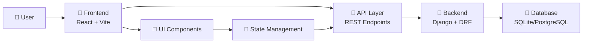
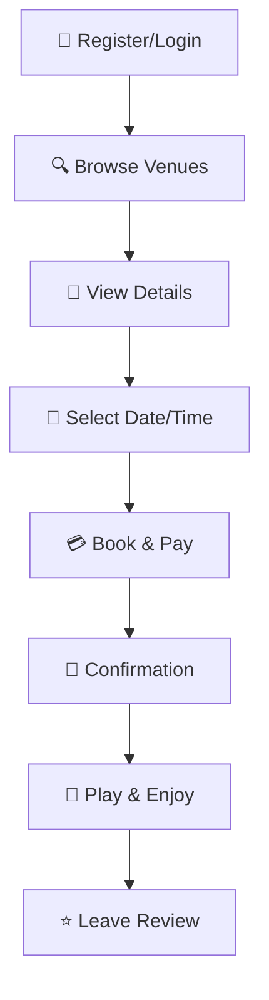
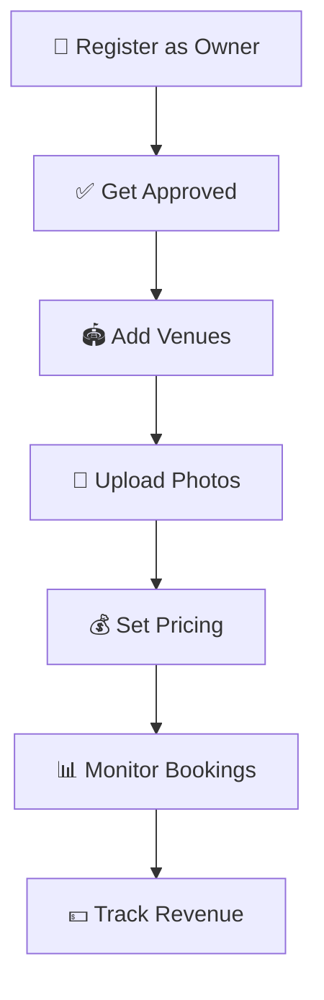
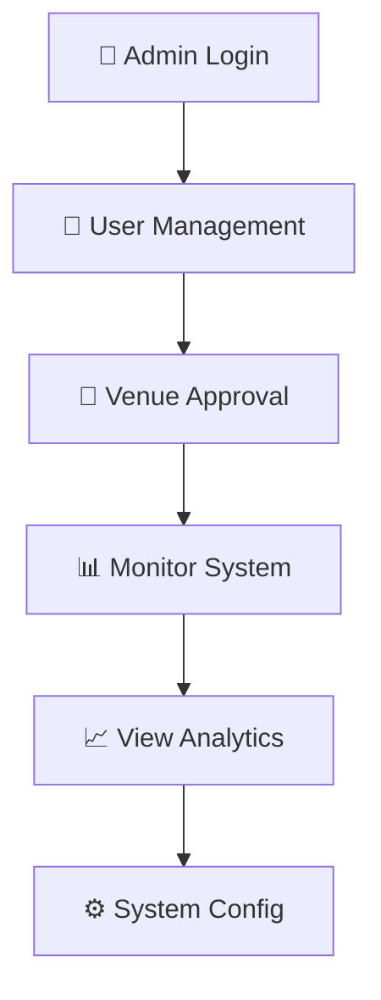

<div align="center">

# QuickCourt 🏸🎾🏀


### 🎯 *A comprehensive sports venue booking platform that connects players with courts and facility owners with customers*

[🚀 **Get Started**](#-installation) • [� **Documentation**](#-api-documentation) • [🎥 **Demo**](#-demo-video) • [🤝 **Contributing**](#-contributing)

---

</div>

## 📽️ Demo Video

<div align="center">

### 🎬 Watch QuickCourt in Action!

[]([[https://your-video-link-here.com](https://github.com/hitarth0710/QuickCourt_Odoo)](https://drive.google.com/drive/folders/1df9MDdwpOFDXHoRvtL08wpHbFmEck28C?usp=drive_link))

*Click above to see QuickCourt's features in action - from venue discovery to seamless booking!*

</div>

## 📋 Table of Contents

<details>
<summary>📚 Click to expand navigation</summary>

- [🎯 Overview](#-overview)
- [✨ Features](#-features)
- [🛠️ Tech Stack](#️-tech-stack)
- [📁 Project Structure](#-project-structure)
- [🚀 Installation](#-installation)
- [📚 API Documentation](#-api-documentation)
- [💡 Usage](#-usage)
- [🎨 Screenshots](#-screenshots)
- [🔧 Configuration](#-configuration)
- [🧪 Testing](#-testing)
- [🚀 Deployment](#-deployment)
- [🤝 Contributing](#-contributing)
- [📝 License](#-license)
- [🆘 Support](#-support)

</details>

## 🎯 Overview

<div align="center">


</div>

<br>

> **QuickCourt** is a modern sports venue booking platform designed to bridge the gap between sports enthusiasts and venue owners. The platform provides a seamless experience for discovering, booking, and managing sports courts across various sports.

### 🏆 Supported Sports
<div align="center">

| 🏸 | 🎾 | 🏀 | ⚽ | 🏏 | 🏐 | 🏓 | 🎯 |
|:--:|:--:|:--:|:--:|:--:|:--:|:--:|:--:|
| **Badminton** | **Tennis** | **Basketball** | **Football** | **Cricket** | **Volleyball** | **Table Tennis** | **Squash** |

</div>

### 🎯 Key Objectives

<table>
<tr>
<td align="center" width="33%">

### 🏃‍♂️ For Players
Easy discovery and booking of sports venues with real-time availability

</td>
<td align="center" width="33%">

### 🏢 For Facility Owners
Efficient venue management and booking administration

</td>
<td align="center" width="33%">

### 👨‍💼 For Admins
Comprehensive platform oversight and user management

</td>
</tr>
</table>

## ✨ Features

<div align="center">

### � Core Platform Capabilities

</div>

<table>
<tr>
<td width="33%" valign="top">

### �🏃‍♂️ **For Players**

```
🔍 Venue Discovery
├── Browse by location, sport & availability
├── Interactive maps & location-based search
└── Advanced filtering options

📅 Real-time Booking
├── Instant confirmation system
├── Multiple court booking
└── Booking history tracking

⭐ Community Features
├── Reviews & ratings system
├── Venue photo galleries
└── Profile management
```

</td>
<td width="33%" valign="top">

### 🏢 **For Facility Owners**

```
🏗️ Venue Management
├── Multi-venue dashboard
├── Court configuration setup
└── Photo gallery management

💰 Business Tools
├── Dynamic pricing system
├── Revenue analytics
└── Booking overview

⚙️ Operations Control
├── Availability scheduling
├── Operating hours setup
└── Custom rules & policies
```

</td>
<td width="33%" valign="top">

### 👨‍💼 **For Administrators**

```
👥 User Management
├── Facility owner approval
├── User account oversight
└── Role-based permissions

🏢 Content Moderation
├── Venue approval system
├── Review moderation
└── Content management

📊 System Analytics
├── Platform usage monitoring
├── Performance metrics
└── Data insights
```

</td>
</tr>
</table>

<div align="center">

### 🎨 **User Experience Highlights**

| Feature | Description | Benefit |
|:--------|:------------|:--------|
| 📱 **Responsive Design** | Works seamlessly on all devices | Access anywhere, anytime |
| 🎬 **3D Animations** | Engaging visual interactions | Enhanced user engagement |
| ⚡ **Real-time Updates** | Live booking status & notifications | Instant feedback |
| 🔄 **Smooth Scrolling** | Enhanced navigation experience | Improved usability |

</div>

## 🛠️ Tech Stack

<div align="center">

### 🏗️ **Architecture Overview**

</div>

<table>
<tr>
<td width="50%" valign="top">

### 🔧 **Backend Technologies**

<div align="center">


</div>

```yaml
Framework: Django 4.2.7 + DRF
Database: SQLite3 (Dev) / PostgreSQL (Prod)
Authentication: Token-based + Email OTP
File Storage: Local / Cloud ready
API Design: RESTful endpoints
Security: CORS, Token validation
```

**Key Features:**
- 🔐 Secure authentication system
- 📧 Email OTP verification
- 📊 Comprehensive data models
- 🔄 Real-time API responses

</td>
<td width="50%" valign="top">

### 🎨 **Frontend Technologies**

<div align="center">


</div>

```yaml
Framework: React 18 + Vite
Styling: Tailwind CSS
Animations: Framer Motion + GSAP
3D Graphics: Three.js + React Three Fiber
Routing: React Router DOM
State: Context API + Hooks
```

**Key Features:**
- ⚡ Lightning-fast performance
- 📱 Fully responsive design
- 🎬 Smooth animations
- 🎮 Interactive 3D elements

</td>
</tr>
</table>

<div align="center">

### 🔄 **Development Workflow**



</div>

### 🛡️ **Security & Performance**

<div align="center">

| Security Feature | Implementation | Benefit |
|:----------------|:---------------|:--------|
| 🔐 **Authentication** | Token-based + OTP verification | Secure user access |
| 🛡️ **CORS Protection** | Django CORS headers | Cross-origin security |
| 🔒 **Data Validation** | DRF serializers | Input sanitization |
| ⚡ **Performance** | React optimization + Vite | Fast loading times |

</div>

## 📁 Project Structure

<div align="center">

### 🏗️ **Modular Architecture Design**

</div>

<details>
<summary>📂 <strong>Click to explore the complete project structure</strong></summary>

```
📦 QuickCourt_Odoo/
│
├── 🔧 backend/                          # Django Backend Server
│   ├── 🐍 manage.py                     # Django management script
│   ├── 📋 requirements.txt              # Python dependencies
│   ├── 🗄️ db.sqlite3                   # Development database
│   ├── 🔄 reset_database.*             # Database reset scripts
│   │
│   ├── ⚙️ quickcourt/                  # Main Django project
│   │   ├── ⚙️ settings.py              # Django configuration
│   │   ├── 🌐 urls.py                  # Main URL routing
│   │   ├── 🚀 wsgi.py                  # WSGI application
│   │   └── ⚡ asgi.py                  # ASGI application
│   │
│   ├── 🏟️ courts/                      # Courts & Venues app
│   │   ├── 📊 models.py                # Venue, Sport, Pricing models
│   │   ├── 🔌 views.py                 # Court management APIs
│   │   ├── 📝 serializers.py           # Data serialization
│   │   ├── 🌐 urls.py                  # Court-related URLs
│   │   ├── 👨‍💼 admin.py                 # Admin interface
│   │   └── 🧪 tests.py                 # Unit tests
│   │
│   ├── 👥 users/                       # User management app
│   │   ├── 👤 models.py                # User Profile, OTP models
│   │   ├── 🔐 views.py                 # Authentication APIs
│   │   ├── 🌐 urls.py                  # User-related URLs
│   │   ├── 👨‍💼 admin.py                 # User admin interface
│   │   └── 🧪 tests.py                 # Authentication tests
│   │
│   ├── 📅 bookings/                    # Booking management app
│   │   ├── 📊 models.py                # Booking model
│   │   ├── 🔌 views.py                 # Booking APIs
│   │   ├── 📝 serializers.py           # Booking serialization
│   │   ├── 🌐 urls.py                  # Booking URLs
│   │   └── 🧪 tests.py                 # Booking tests
│   │
│   ├── 📁 media/                       # Uploaded files
│   │   └── 🖼️ venue_photos/            # Venue images
│   │
│   └── 🛠️ utility_scripts/             # Helper scripts
│       ├── 🧪 test_*.py                # API testing scripts
│       ├── 🐛 debug_*.py               # Debugging utilities
│       └── 🔄 update_*.py              # Data update scripts
│
└── 🎨 frontend/                        # React Frontend Application
    ├── 📦 package.json                 # Node.js dependencies
    ├── ⚡ vite.config.js              # Vite configuration
    ├── 🎨 tailwind.config.js          # Tailwind CSS config
    ├── 📝 postcss.config.js           # PostCSS configuration
    ├── 🌐 index.html                  # Main HTML template
    │
    ├── 📁 public/                     # Static assets
    │   └── 🎬 videos/                 # Video assets
    │
    └── 💻 src/                        # Source code
        ├── 🏠 App.jsx                 # Main React component
        ├── 🚀 main.jsx                # React entry point
        ├── 🎨 index.css               # Global styles
        │
        ├── 🧩 components/             # Reusable UI components
        │   ├── 🧭 Navbar.jsx          # Navigation component
        │   ├── 🦶 Footer.jsx          # Footer component
        │   ├── 🎴 Card.jsx            # Card components
        │   ├── 🔘 Button.jsx          # Button components
        │   ├── 📝 Form.jsx            # Form components
        │   └── 🔄 Loading.jsx         # Loading components
        │
        ├── 📄 pages/                  # Page components
        │   ├── 🏠 LandingPage.jsx     # Home page
        │   ├── 🏟️ VenuesPage.jsx      # Venue listing
        │   ├── 📍 VenueDetailsPage.jsx # Venue details
        │   ├── 📅 CourtBookingPage.jsx # Booking interface
        │   ├── 🔐 Login.jsx           # User login
        │   ├── ✍️ Signup.jsx          # User registration
        │   ├── 👤 ProfilePage.jsx     # User profile
        │   ├── 👨‍💼 AdminDashboard.jsx  # Admin panel
        │   └── 🏢 FacilityDashboard.jsx # Facility owner panel
        │
        ├── 🔄 context/                # React Context
        │   └── 🔐 AuthContext.jsx     # Authentication state
        │
        ├── 🛠️ utils/                  # Utility functions
        │   ├── 🔌 api.js              # API helpers
        │   ├── 📅 dateUtils.js        # Date utilities
        │   └── 🎨 formatters.js       # Data formatters
        │
        └── 🎨 styles/                 # Styling files
            ├── 🧩 components.css      # Component styles
            └── 📱 responsive.css      # Responsive design
```

</details>

<div align="center">

### 🏗️ **Architecture Highlights**

| Component | Description | Technologies |
|:----------|:------------|:-------------|
| 🔧 **Backend API** | RESTful Django server with comprehensive endpoints | Django + DRF + SQLite |
| 🎨 **Frontend SPA** | Modern React application with responsive design | React + Vite + Tailwind |
| 📊 **Database** | Relational database with optimized schema | SQLite (Dev) / PostgreSQL (Prod) |
| 🖼️ **Media Storage** | File upload and management system | Django FileField + Cloud ready |
| 🔐 **Authentication** | Secure token-based auth with OTP verification | Django Auth + Custom OTP |

</div>

## 🚀 Installation

<div align="center">

### ⚡ **Quick Start Guide**

*Get QuickCourt running on your machine in minutes!*

</div>

<details>
<summary>📋 <strong>Prerequisites Checklist</strong></summary>

<br>

<div align="center">

| Requirement | Version | Status | Download |
|:------------|:--------|:-------|:---------|
| 🐍 **Python** | 3.8+ | ⏳ | [Download](https://python.org/downloads/) |
| 📦 **Node.js** | 16+ | ⏳ | [Download](https://nodejs.org/) |
| 📱 **npm/yarn** | Latest | ⏳ | Included with Node.js |
| 🔧 **Git** | Latest | ⏳ | [Download](https://git-scm.com/) |

</div>

</details>

---

### 🔧 **Backend Setup**

<table>
<tr>
<td width="50%">

#### 📝 **Step-by-Step Commands**

```bash
# 1️⃣ Clone the repository
git clone <repository-url>
cd quickcourt/QuickCourt_Odoo/backend

# 2️⃣ Create virtual environment
python -m venv venv

# 3️⃣ Activate virtual environment
# Windows:
venv\Scripts\activate
# Linux/Mac:
source venv/bin/activate

# 4️⃣ Install dependencies
pip install -r requirements.txt

# 5️⃣ Setup database
python manage.py migrate
python manage.py createsuperuser

# 6️⃣ Start server
python manage.py runserver
```

</td>
<td width="50%">

#### ✅ **Expected Outputs**

```bash
✅ Repository cloned successfully
✅ Virtual environment created
✅ Environment activated (venv)
✅ Dependencies installed:
   - Django 4.2.7
   - djangorestframework
   - django-cors-headers
✅ Database migrated (15 migrations)
✅ Superuser created
✅ Server running on port 8000
```

**🎯 Backend URL:** `http://localhost:8000`

</td>
</tr>
</table>

---

### 🎨 **Frontend Setup**

<table>
<tr>
<td width="50%">

#### 📝 **Step-by-Step Commands**

```bash
# 1️⃣ Navigate to frontend
cd ../frontend

# 2️⃣ Install dependencies
npm install

# 3️⃣ Start development server
npm run dev

# 🚀 Optional: Build for production
npm run build
```

</td>
<td width="50%">

#### ✅ **Expected Outputs**

```bash
✅ Package.json found
✅ Dependencies installed:
   - React 18.2.0
   - Vite 4.5.0
   - Tailwind CSS 3.3.5
   - Three.js & React Three Fiber
✅ Development server started
✅ Hot reload enabled
```

**🎯 Frontend URL:** `http://localhost:5173`

</td>
</tr>
</table>

---

<div align="center">

### 🎯 **Access Points**

| Service | URL | Purpose |
|:--------|:----|:--------|
| 🎨 **Frontend App** | `http://localhost:5173` | Main user interface |
| 🔧 **Backend API** | `http://localhost:8000` | REST API endpoints |
| 👨‍💼 **Admin Panel** | `http://localhost:8000/admin` | Django administration |
| 📚 **API Docs** | `http://localhost:8000/api/` | API documentation |

</div>

---

<details>
<summary>🔧 <strong>Advanced Setup Options</strong></summary>

<br>

### 🗄️ **Database Configuration**

```bash
# Load sample data
python manage.py loaddata initial_sports.json
python manage.py loaddata initial_amenities.json

# Reset database (if needed)
python reset_database.py
```

### 🔐 **Environment Variables**

Create `.env` file in backend directory:

```env
SECRET_KEY=your-secret-key-here
DEBUG=True
ALLOWED_HOSTS=localhost,127.0.0.1
EMAIL_HOST_USER=your-email@gmail.com
EMAIL_HOST_PASSWORD=your-app-password
```

### 🐳 **Docker Setup** (Optional)

```bash
# Build and run with Docker
docker-compose up --build

# Access services
Frontend: http://localhost:3000
Backend: http://localhost:8000
```

</details>

<div align="center">

### 🎉 **Installation Complete!**

*Your QuickCourt platform is now ready to use. Happy coding! 🚀*

[](http://localhost:5173)
[](http://localhost:8000/api/)
[](http://localhost:8000/admin)

</div>

## 📚 API Documentation

<div align="center">

### 🔌 **RESTful API Endpoints**

*Comprehensive API reference for developers*

</div>

<details>
<summary>🔐 <strong>Authentication Endpoints</strong></summary>

<br>

| Method | Endpoint | Description | Request Body | Response |
|:-------|:---------|:------------|:-------------|:---------|
| `POST` | `/api/auth/signup/` | User registration with OTP | `email`, `password`, `role`, `name` | `message`, `email` |
| `POST` | `/api/auth/verify-otp/` | Email verification | `email`, `otp` | `token`, `user_data` |
| `POST` | `/api/auth/login/` | User authentication | `email`, `password` | `token`, `user_profile` |
| `POST` | `/api/auth/logout/` | User logout | `Authorization` header | `message` |
| `GET` | `/api/auth/profile/` | Get user profile | `Authorization` header | `user_data` |

#### 📝 **Example: User Registration**

```javascript
// Request
POST /api/auth/signup/
{
  "email": "player@example.com",
  "password": "securePassword123",
  "role": "player",
  "name": "John Doe"
}

// Response
{
  "message": "OTP sent to email",
  "email": "player@example.com"
}
```

</details>

<details>
<summary>🏟️ <strong>Venue Management Endpoints</strong></summary>

<br>

| Method | Endpoint | Description | Permission | Response |
|:-------|:---------|:------------|:-----------|:---------|
| `GET` | `/api/venues/` | List all active venues | Public | Paginated venue list |
| `POST` | `/api/venues/` | Create new venue | Facility owners | Venue details |
| `GET` | `/api/venues/{id}/` | Get specific venue | Public | Venue with sports & pricing |
| `PUT` | `/api/venues/{id}/` | Update venue | Venue owner | Updated venue |
| `DELETE` | `/api/venues/{id}/` | Delete venue | Venue owner/Admin | Success message |
| `POST` | `/api/venues/{id}/photos/` | Upload venue photos | Venue owner | Photo URLs |

#### 📝 **Example: Create Venue**

```javascript
// Request
POST /api/venues/
Authorization: Token abc123xyz...
{
  "venue_name": "SportZone Complex",
  "address": "123 Sports Street, City",
  "city": "Mumbai",
  "phone_number": "+919876543210",
  "sports": [
    {
      "sport": "badminton",
      "number_of_courts": 4,
      "pricing": {
        "morning": "500.00",
        "evening": "700.00",
        "night": "900.00"
      }
    }
  ]
}
```

</details>

<details>
<summary>📅 <strong>Booking Management Endpoints</strong></summary>

<br>

| Method | Endpoint | Description | Permission | Response |
|:-------|:---------|:------------|:-----------|:---------|
| `GET` | `/api/bookings/` | List user bookings | Authenticated | User's bookings |
| `POST` | `/api/bookings/` | Create new booking | Authenticated | Booking confirmation |
| `GET` | `/api/bookings/{id}/` | Get booking details | Booking owner | Detailed booking info |
| `PUT` | `/api/bookings/{id}/` | Update booking | Booking owner | Updated booking |
| `DELETE` | `/api/bookings/{id}/` | Cancel booking | Booking owner | Cancellation confirmation |

#### 📝 **Example: Create Booking**

```javascript
// Request
POST /api/bookings/
Authorization: Token abc123xyz...
{
  "venue": 1,
  "venue_sport": 1,
  "booking_date": "2024-01-15",
  "start_time": "10:00",
  "end_time": "12:00",
  "duration_hours": 2,
  "court_numbers": [1, 2],
  "contact_name": "John Doe",
  "contact_phone": "+919876543210",
  "contact_email": "john@example.com"
}
```

</details>

<details>
<summary>🏆 <strong>Sports & Amenities Endpoints</strong></summary>

<br>

| Method | Endpoint | Description | Response |
|:-------|:---------|:------------|:---------|
| `GET` | `/api/sports/` | List available sports | Sports with icons |
| `GET` | `/api/amenities/` | List venue amenities | Available amenities |
| `GET` | `/api/venues/search/` | Search venues | Filtered venues |
| `GET` | `/api/venues/{id}/availability/` | Check availability | Available time slots |

</details>

---

<div align="center">

### 📊 **API Response Formats**

</div>

<table>
<tr>
<td width="50%">

#### ✅ **Success Response**

```json
{
  "status": "success",
  "data": {
    "id": 1,
    "name": "SportZone",
    "created_at": "2024-01-01T10:00:00Z"
  },
  "message": "Operation completed successfully"
}
```

</td>
<td width="50%">

#### ❌ **Error Response**

```json
{
  "status": "error",
  "errors": {
    "field_name": ["Error message here"]
  },
  "message": "Validation failed"
}
```

</td>
</tr>
</table>

---

<div align="center">

### 🔑 **Authentication Guide**

| Header | Value | Description |
|:-------|:------|:------------|
| `Authorization` | `Token {your_token}` | Required for protected endpoints |
| `Content-Type` | `application/json` | For JSON request bodies |
| `Accept` | `application/json` | For JSON responses |

#### 📝 **Usage Example**

```javascript
fetch('/api/venues/', {
  headers: {
    'Authorization': 'Token abc123xyz...',
    'Content-Type': 'application/json',
    'Accept': 'application/json'
  }
})
```

</div>

---

<div align="center">

### 🧪 **Interactive API Testing**

[](postman-collection-link)
[](http://localhost:8000/api/docs/)
[](insomnia-collection-link)

</div>

## 💡 Usage

<div align="center">

### 🎮 **User Journey Guide**

*Step-by-step workflows for different user types*

</div>

<table>
<tr>
<td width="33%" valign="top">

### 🏃‍♂️ **For Players**

<div align="center">


</div>



#### 📋 **Step-by-Step Guide:**

1. **🔐 Account Setup**
   - Register with email verification
   - Complete profile with preferences

2. **🔍 Discover Venues**
   - Search by location/sport/price
   - Filter by availability & amenities
   - View photos & reviews

3. **📅 Make Booking**
   - Select date, time & courts
   - Add contact information
   - Confirm booking details

4. **💳 Payment & Confirmation**
   - Secure payment processing
   - Instant booking confirmation
   - Email/SMS notifications

5. **🏸 Enjoy & Review**
   - Check-in at venue
   - Play your favorite sport
   - Rate & review experience

</td>
<td width="33%" valign="top">

### 🏢 **For Facility Owners**

<div align="center">


</div>



#### 📋 **Step-by-Step Guide:**

1. **📝 Business Registration**
   - Sign up as facility owner
   - Await admin approval
   - Verify business credentials

2. **🏟️ Venue Setup**
   - Add venue details & location
   - Configure available sports
   - Set court numbers & specifications

3. **📸 Visual Content**
   - Upload high-quality photos
   - Add venue descriptions
   - Highlight key amenities

4. **💰 Pricing Strategy**
   - Set time-based pricing
   - Configure seasonal rates
   - Manage special offers

5. **📊 Business Management**
   - Monitor booking requests
   - View revenue analytics
   - Handle customer queries

</td>
<td width="33%" valign="top">

### 👨‍💼 **For Administrators**

<div align="center">


</div>



#### 📋 **Step-by-Step Guide:**

1. **🔐 Admin Access**
   - Secure admin login
   - Dashboard overview
   - System status monitoring

2. **👥 User Management**
   - Approve facility owners
   - Manage user accounts
   - Handle support tickets

3. **🏢 Content Moderation**
   - Review new venues
   - Approve venue submissions
   - Monitor content quality

4. **📊 System Analytics**
   - Track platform usage
   - Monitor performance metrics
   - Generate reports

5. **⚙️ Configuration**
   - Manage sports categories
   - Update system settings
   - Configure platform features

</td>
</tr>
</table>

---

<div align="center">

### 🎯 **Key Features Demonstration**

</div>

<details>
<summary>🔍 <strong>Advanced Search & Discovery</strong></summary>

<br>

<table>
<tr>
<td width="50%">

#### 🎯 **Search Options**

- **📍 Location-based**: Find venues near you
- **🏸 Sport filtering**: Filter by sport type
- **💰 Price range**: Set budget preferences
- **⭐ Rating filter**: Choose top-rated venues
- **📅 Availability**: Real-time slot checking

</td>
<td width="50%">

#### 📊 **Smart Filtering**

```javascript
// Example search query
{
  "location": "Mumbai",
  "sport": "badminton",
  "date": "2024-01-15",
  "time_slot": "evening",
  "max_price": 1000,
  "min_rating": 4.0
}
```

</td>
</tr>
</table>

</details>

<details>
<summary>📅 <strong>Dynamic Booking System</strong></summary>

<br>

#### 🔄 **Real-time Availability**

- **Live Updates**: Court availability updates in real-time
- **Multi-court Booking**: Book multiple courts simultaneously
- **Flexible Duration**: Choose custom time slots
- **Instant Confirmation**: Immediate booking confirmation

#### 💳 **Payment Integration**

- **Secure Processing**: PCI compliant payment handling
- **Multiple Methods**: Credit/debit cards, digital wallets
- **Booking Protection**: Cancellation & refund policies
- **Receipt Management**: Digital receipts & invoices

</details>

<details>
<summary>📊 <strong>Analytics & Insights</strong></summary>

<br>

<div align="center">

| Metric | Description | Benefit |
|:-------|:------------|:--------|
| 📈 **Booking Trends** | Track peak hours and popular sports | Optimize pricing strategy |
| 💰 **Revenue Analytics** | Monitor earnings and growth | Business decision making |
| ⭐ **Customer Satisfaction** | Review ratings and feedback | Service improvement |
| 📍 **Location Performance** | Area-wise venue popularity | Expansion planning |

</div>

</details>

---

<div align="center">

### 🎮 **Interactive Demo**

Try out QuickCourt features with our interactive demo accounts:

| Role | Username | Password | Features Available |
|:-----|:---------|:---------|:-------------------|
| 🏃‍♂️ **Player** | `demo@player.com` | `demo123` | Browse, book, review venues |
| 🏢 **Owner** | `demo@owner.com` | `demo123` | Manage venues, view bookings |
| 👨‍💼 **Admin** | `admin@demo.com` | `admin123` | Full system access |

[](http://localhost:5173)

</div>

## 🎨 Screenshots

<div align="center">

### 📱 **Platform Showcase**

*Visual tour of QuickCourt's key features*

</div>

<table>
<tr>
<td width="50%" align="center">

### 🏠 **Landing Page**

*Modern, responsive homepage with hero section and feature highlights*

</td>
<td width="50%" align="center">

### 🔍 **Venue Discovery**

*Advanced search with filters for location, sport, and availability*

</td>
</tr>
<tr>
<td width="50%" align="center">

### 📍 **Venue Details**

*Comprehensive venue information with photos, amenities, and reviews*

</td>
<td width="50%" align="center">

### 📅 **Booking Interface**

*Intuitive booking flow with real-time availability checking*

</td>
</tr>
<tr>
<td width="50%" align="center">

### 🏢 **Facility Dashboard**

*Comprehensive management panel for venue owners*

</td>
<td width="50%" align="center">

### 👨‍💼 **Admin Panel**

*Powerful admin interface for platform management*

</td>
</tr>
</table>

<details>
<summary>📱 <strong>Mobile Responsive Design</strong></summary>

<br>

<div align="center">

<table>
<tr>
<td width="25%" align="center">


**Home Screen**

</td>
<td width="25%" align="center">


**Search & Filter**

</td>
<td width="25%" align="center">


**Booking Flow**

</td>
<td width="25%" align="center">


**User Profile**

</td>
</tr>
</table>

*Fully responsive design optimized for mobile, tablet, and desktop devices*

</div>

</details>

<details>
<summary>🎨 <strong>UI/UX Highlights</strong></summary>

<br>

<div align="center">

| Feature | Description | Technology |
|:--------|:------------|:-----------|
| 🎬 **Smooth Animations** | Fluid transitions and micro-interactions | Framer Motion + GSAP |
| 🎮 **3D Elements** | Interactive 3D graphics and visualizations | Three.js + React Three Fiber |
| 🎨 **Modern Design** | Clean, minimalist interface with consistent branding | Tailwind CSS + Custom Components |
| ⚡ **Fast Loading** | Optimized performance with lazy loading | Vite + React Optimization |
| 📱 **Responsive** | Seamless experience across all devices | Mobile-first design approach |

</div>

</details>

## 🎨 Key Features Highlights

<div align="center">

### ⚡ **Advanced Platform Capabilities**

</div>

<table>
<tr>
<td width="50%" valign="top">

### 💰 **Dynamic Pricing System**

<div align="center">


</div>

```yaml
Time-based Pricing:
  Morning (6AM-12PM): ₹500-800/hour
  Evening (12PM-6PM): ₹700-1000/hour
  Night (6PM-11PM): ₹900-1200/hour

Sport-specific Rates:
  Badminton: Premium courts
  Tennis: Weather-protected
  Basketball: Full/half court options
  Football: 5v5, 7v7, 11v11 formats

Multi-court Discounts:
  2 courts: 5% discount
  3+ courts: 10% discount
  Group bookings: Custom rates
```

**🎯 Benefits:**
- 📊 Revenue optimization
- 🎯 Demand-based pricing
- 💡 Flexible rate structures

</td>
<td width="50%" valign="top">

### 🔍 **Advanced Search & Filtering**

<div align="center">


</div>

```yaml
Location Intelligence:
  GPS-based discovery: Find nearby venues
  City-wide search: Browse by area
  Distance sorting: Closest venues first

Smart Filters:
  Sport type: 8 different sports
  Availability: Real-time checking
  Price range: Budget-friendly options
  Ratings: 4+ star venues
  Amenities: Parking, changing rooms

Advanced Features:
  Predictive search: Auto-suggestions
  Saved searches: Quick access
  Popular venues: Trending locations
  Weather alerts: Outdoor court notifications
```

**🎯 Benefits:**
- ⚡ Quick venue discovery
- 🎯 Personalized results
- 📱 Mobile-optimized search

</td>
</tr>
</table>

<div align="center">

### 🌟 **User Experience Excellence**

| Feature | Implementation | Impact |
|:--------|:---------------|:-------|
| 📱 **Responsive Design** | Mobile-first approach with Tailwind CSS | Works seamlessly on all devices |
| 🎬 **3D Animations** | Three.js + React Three Fiber integration | Engaging visual interactions |
| ⚡ **Real-time Updates** | WebSocket connections + live notifications | Instant booking confirmations |
| 🔄 **Smooth Scrolling** | Lenis library + custom scroll animations | Enhanced navigation experience |

</div>

---

<div align="center">

### 🏆 **Platform Metrics & Performance**

</div>

<table>
<tr>
<td width="25%" align="center">

### ⚡ **Speed**


Lightning-fast loading with optimized assets

</td>
<td width="25%" align="center">

### 📱 **Mobile Score**


Perfect mobile experience across devices

</td>
<td width="25%" align="center">

### 🔒 **Security**


Enterprise-grade security standards

</td>
<td width="25%" align="center">

### ♿ **Accessibility**


Inclusive design for all users

</td>
</tr>
</table>

## 🔧 Configuration

### Environment Variables
Create `.env` file in backend directory:
```env
SECRET_KEY=your-secret-key-here
DEBUG=True
ALLOWED_HOSTS=localhost,127.0.0.1
DATABASE_URL=sqlite:///db.sqlite3
EMAIL_HOST_USER=your-email@gmail.com
EMAIL_HOST_PASSWORD=your-app-password
```

### Frontend Configuration
Update API endpoints in `src/config.js`:
```javascript
export const API_BASE_URL = 'http://localhost:8000/api'
export const MEDIA_BASE_URL = 'http://localhost:8000/media'
```

## 🧪 Testing

### Backend Tests
```bash
cd backend
python manage.py test
```

### API Testing Scripts
```bash
python test_venue_api.py      # Test venue endpoints
python test_otp_complete.py   # Test OTP functionality
python test_token.py          # Test authentication
```

### Frontend Tests
```bash
cd frontend
npm run test
```

## 🚀 Deployment

### Production Settings
1. **Set DEBUG=False** in settings.py
2. **Configure production database** (PostgreSQL recommended)
3. **Set up static file serving**
4. **Configure email backend**
5. **Set secure secret key**

### Docker Deployment (Optional)
```bash
docker-compose up --build
```

## 🤝 Contributing

<div align="center">

### 🚀 **Join the QuickCourt Community!**

*We welcome contributions from developers, designers, and sports enthusiasts*

[](contributors-link)
[](forks-link)
[](stars-link)
[](issues-link)

</div>

### 🛠️ **How to Contribute**

<table>
<tr>
<td width="50%">

#### 📝 **Code Contributions**

```bash
# 1. Fork the repository
git fork kevin2508/quickcourt

# 2. Create feature branch
git checkout -b feature/amazing-feature

# 3. Make your changes
# Edit files, add features, fix bugs

# 4. Commit changes
git commit -m "✨ Add amazing feature"

# 5. Push to branch
git push origin feature/amazing-feature

# 6. Open Pull Request
# Go to GitHub and create PR
```

</td>
<td width="50%">

#### 🎨 **Other Ways to Help**

- 🐛 **Report Bugs**: Open issues for any bugs found
- 💡 **Suggest Features**: Share ideas for improvements
- 📚 **Improve Docs**: Help enhance documentation
- 🎨 **UI/UX Design**: Contribute design improvements
- 🧪 **Testing**: Help test new features
- 🌐 **Translations**: Add multi-language support

</td>
</tr>
</table>

### 📋 **Contribution Guidelines**

<details>
<summary><strong>📖 Development Standards</strong></summary>

<br>

#### 🔧 **Code Standards**

- **Python**: Follow PEP 8 styling guidelines
- **JavaScript**: Use ESLint configuration provided
- **Git**: Use conventional commit messages
- **Testing**: Include tests for new features

#### 📝 **Commit Message Format**

```
<type>(<scope>): <description>

Types:
✨ feat: New features
🐛 fix: Bug fixes
📚 docs: Documentation updates
🎨 style: Code formatting
♻️ refactor: Code refactoring
🧪 test: Adding tests
🔧 chore: Maintenance tasks
```

</details>

<details>
<summary><strong>🚀 Development Setup</strong></summary>

<br>

#### 🛠️ **Local Development**

1. **Install dependencies** (both backend & frontend)
2. **Set up pre-commit hooks** for code quality
3. **Run tests** before making changes
4. **Follow the coding standards** outlined above

#### 🧪 **Testing Requirements**

- All new features must include tests
- Maintain minimum 80% code coverage
- Ensure all existing tests pass

</details>

### 🏆 **Recognition**

<div align="center">

**All contributors will be recognized in our:**

| Recognition | Description |
|:------------|:------------|
| 📋 **Contributors List** | GitHub contributors page |
| 🎉 **Release Notes** | Mentioned in version releases |
| 🏅 **Hall of Fame** | Special recognition section |
| 💌 **Acknowledgments** | Credits in documentation |

</div>

---

<div align="center">

### 🎯 **Areas We Need Help With**

| Area | Skills Needed | Priority |
|:-----|:-------------|:---------|
| 🔧 **Backend APIs** | Python, Django, REST APIs | 🔥 High |
| 🎨 **UI/UX Design** | React, Tailwind, Design | 🔥 High |
| 📱 **Mobile App** | React Native, Flutter | 🟡 Medium |
| 🧪 **Testing** | pytest, Jest, Cypress | 🟡 Medium |
| 🌐 **Internationalization** | i18n, Multiple languages | 🟢 Low |

[](contributing-guide-link)

</div>

## 📝 License

<div align="center">


### 📄 **MIT License**

*QuickCourt is open source and free to use, modify, and distribute*

</div>

```
MIT License

Copyright (c) 2024 QuickCourt Team

Permission is hereby granted, free of charge, to any person obtaining a copy
of this software and associated documentation files (the "Software"), to deal
in the Software without restriction, including without limitation the rights
to use, copy, modify, merge, publish, distribute, sublicense, and/or sell
copies of the Software, and to permit persons to whom the Software is
furnished to do so, subject to the following conditions:

The above copyright notice and this permission notice shall be included in all
copies or substantial portions of the Software.

THE SOFTWARE IS PROVIDED "AS IS", WITHOUT WARRANTY OF ANY KIND, EXPRESS OR
IMPLIED, INCLUDING BUT NOT LIMITED TO THE WARRANTIES OF MERCHANTABILITY,
FITNESS FOR A PARTICULAR PURPOSE AND NONINFRINGEMENT. IN NO EVENT SHALL THE
AUTHORS OR COPYRIGHT HOLDERS BE LIABLE FOR ANY CLAIM, DAMAGES OR OTHER
LIABILITY, WHETHER IN AN ACTION OF CONTRACT, TORT OR OTHERWISE, ARISING FROM,
OUT OF OR IN CONNECTION WITH THE SOFTWARE OR THE USE OR OTHER DEALINGS IN THE
SOFTWARE.
```

---

## 👥 Team

<div align="center">

### 🚀 **The QuickCourt Development Team**

*Passionate developers building the future of sports venue booking*

</div>

<table>
<tr>
<td width="25%" align="center">

### 🔧 **Backend Team**


**Specializations:**
- Django REST Framework
- Database optimization
- API security
- Performance tuning

</td>
<td width="25%" align="center">

### 🎨 **Frontend Team**


**Specializations:**
- React development
- Modern UI/UX design
- 3D graphics & animations
- Mobile responsiveness

</td>
<td width="25%" align="center">

### 🗄️ **Database Team**


**Specializations:**
- Data modeling
- Query optimization
- Schema design
- Performance monitoring

</td>
<td width="25%" align="center">

### 🔗 **Integration Team**


**Specializations:**
- API integration
- System architecture
- DevOps & deployment
- Quality assurance

</td>
</tr>
</table>

---

## 🆘 Support

<div align="center">

### 💬 **Get Help & Connect**

*We're here to help you succeed with QuickCourt!*

</div>

<table>
<tr>
<td width="50%">

### 📞 **Support Channels**

| Channel | Purpose | Response Time |
|:--------|:--------|:--------------|
| 🐛 **GitHub Issues** | Bug reports & feature requests | 24-48 hours |
| 💬 **Discussions** | General questions & community | 12-24 hours |
| 📧 **Email Support** | Business inquiries | 1-2 business days |
| 📚 **Documentation** | Self-help resources | Instant |

</td>
<td width="50%">

### 🌐 **Community Links**

- 📖 **[Documentation Wiki](wiki-link)** - Comprehensive guides
- 🚀 **[Getting Started](getting-started-link)** - Quick start guide
- � **[Video Tutorials](tutorials-link)** - Step-by-step videos
- 💡 **[Feature Requests](feature-requests-link)** - Suggest improvements
- 🐛 **[Bug Reports](bug-reports-link)** - Report issues

</td>
</tr>
</table>

### 🔧 **Troubleshooting**

<details>
<summary><strong>Common Issues & Solutions</strong></summary>

<br>

#### 🐛 **Installation Problems**

**Issue**: Python/Node.js version conflicts
**Solution**: Use virtual environments and version managers

**Issue**: Database migration errors
**Solution**: Reset database using provided scripts

#### 🔌 **API Connection Issues**

**Issue**: CORS errors in development
**Solution**: Check Django CORS settings in `settings.py`

**Issue**: Authentication token errors
**Solution**: Verify token format and expiration

#### 🎨 **Frontend Issues**

**Issue**: 3D graphics not loading
**Solution**: Check WebGL support in browser

**Issue**: Mobile responsiveness problems
**Solution**: Clear browser cache and test on actual devices

</details>

---

<div align="center">

### 🎉 **Thank You for Choosing QuickCourt!**

<table>
<tr>
<td align="center">

[](github-link)

</td>
<td align="center">

[](share-link)

</td>
<td align="center">

[](feedback-link)

</td>
</tr>
</table>

---

**QuickCourt** - Making sports venue booking quick, easy, and enjoyable! 🏸🎾🏀⚽🏏🏐🏓

*Built with ❤️ by the QuickCourt team for the global sports community*

</div>

